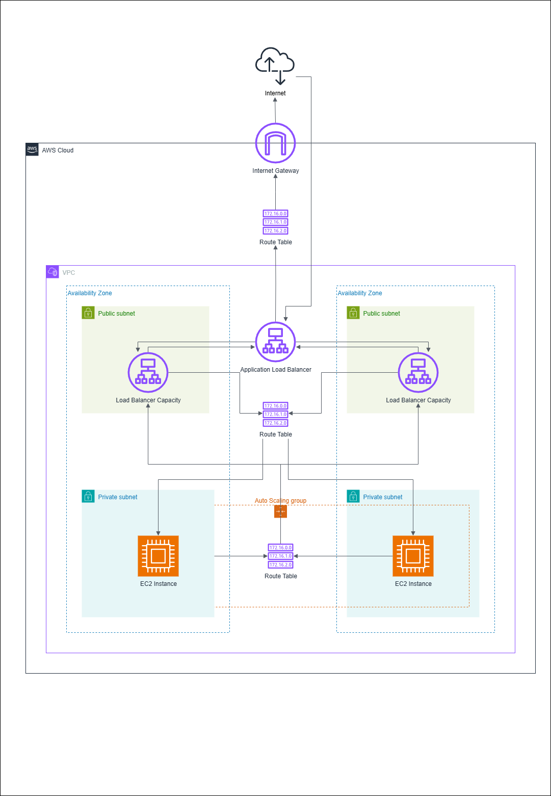

# devops-showcase

## Overview

My name is Ian Shaw

I have experience in cloud infrastructure design, deployment and maintenance.

This repository serves as my portfolio, demonstrating some of my capabilities as a DevOps Engineer.

This project demonstrates a highly available web application deployed to AWS using terraform.

## Architecture

This is a flask web application running a minimal configuration. Prepared using packer.

The architecture uses both auto-scaling groups as well as a load balancer.

This provides high-availability by provisioning ec2 hosts in at least two availability zones.

It also provides elasticity, as the auto scaling group can expand and contract depending on usage.

The application runs on ec2 instances, which use an AMI created by packer.

The ec2 instances are part of an autoscaling group, which is configured to deploy to two private subnets.

The load balancer is associated with two public subnets.

Those two public subnets are associated with a route table which contains a route which allows communication to the internet via an internet gateway.

There is a route table which enables communication between the private and public subnets.

Application traffic is not sent over the internet.

Application traffic flows on port 5000 from the ec2 instances to the load balancer only.

This is enforced by security group rules.

## Deployment Instructions

- Configure AWS CLI with `aws configure`
- change directory to `packer`
- run `packer build .`
- change directory to `terraform-aws-infra`
- run `terraform init`
- run `terraform plan -out=planfile`
- run `terraform apply planfile`

- Copy `loadbalancer_public_dns` from the output into the address bar of your browser.
- Press return

You will see "Hello, World!".

## Cleanup Instructions

- run `terraform destroy`

## Key learnings
- I have chosen to manually create vpc resources rather than use the commonly used vpc module. 
- It is of critical importance to ensure that the private subnet is actually private. Only the public subnets should have routes which allow communication over the internet

## TODO
- network ACL restrict private subnet traffic to application traffic from load balancer
- refactor all values into data.tf
- make this whole pattern into a module which can be called with as little input data as possible